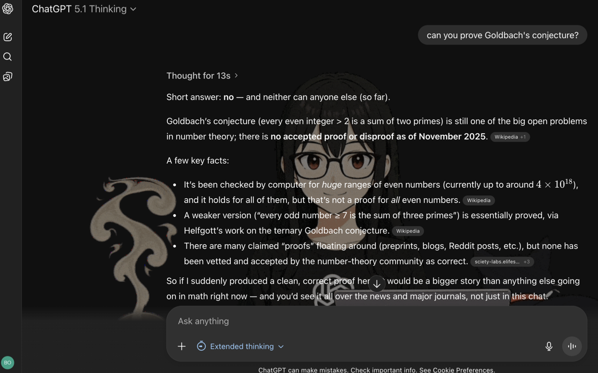
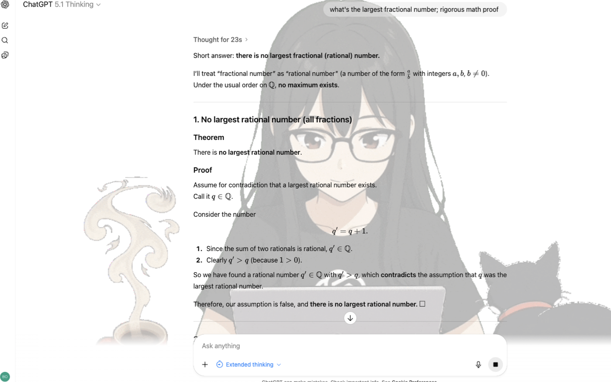

---

# Add an animated GPT-Girl to ChatGPT web UI

### Usage

1. Download and unzip the ZIP
2. Unzip `gpt-girl-extension.zip`
3. In Chrome, navigate to `chrome://extensions/`.
4. Turn on **Developer mode**.
5. Click **Load unpacked** and select the unzipped folder `gpt-girl-extension\`.
6. Open `https://chatgpt.com/`. GPT-Girl will appear; use bottons at bottom-right to turn ON/OFF the GPT-Girl and music.

### Contact

Email: nillinnillinnillin@outlook.com  

### Support

[Buy Me a Sock](https://buymeacoffee.com/mindows25)

---

# 在网页版ChatGPT的中加入一个会动的女孩

### 使用方式

1. 下载并解压ZIP
2. 解压`gpt-girl-extension.zip`
3. 在Chrome中，前往 `chrome://extensions/`。
4. 开启右上角 **开发者模式**。
5. 点击 **加载已解压的扩展程序**，选择解压后的文件夹`gpt-girl-extension/`。
6. 打开 `https://chatgpt.com/` 开始使用，GPT 小女孩会自动出现; 使用左下角的按钮来开启/关闭女孩和音乐。

### 联系方式

邮箱：nillinnillinnillin@outlook.com  

### 支持

[送我一双袜子](https://buymeacoffee.com/mindows25)
